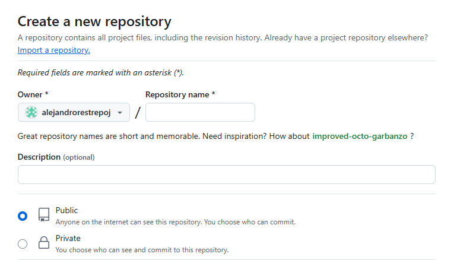
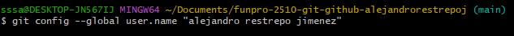

# Como crear un repositorio remoto en Github y sincronizarlo con el repositorio local.

Paso 1: Iniciar sesion en Github y crear un repositorio (Llenar todos los datos necesarios tal como nombre, descripcion, ponerlo publico.)

Paso 2: Hacer que el nombre del repositorio local, usuario e email coincidan con el de Github haciendo uso del comando "git config --global user.name/user.email"

Paso 3: Copiar la URL del repositorio remoto, y agregar el repositorio remoto al repositorio local con el comando "git remote add origin URL"

